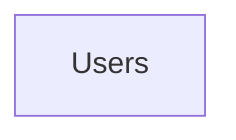
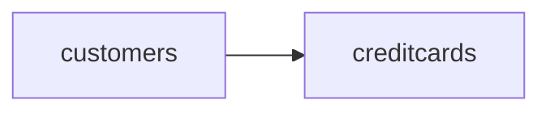

# API CLIENTES

Api rest para el registro, modificación y eliminación de clientes y su tarjeta de crédito

# Acceso local

Por defecto el proyecto se encuentra en el puerto 8080, si se requiere se debe cambiar el puerto en el **aplication properties**.

Las rutas se encuentran protegidas mediante json web token, para acceder a ellas es necesario ingresar por medio de la ruta pública  http://localhost:8080/api/v1/users 
que permite crear un usuario en base de datos.
Con estos datos se debe ingresar en la ruta http://localhost:8080/api/v1/users/login para loguearse y generar el token de autenticación que debe ser enviado a las demás url para poder acceder.

## Url's de acceso

#### Registro clientes
**http://localhost:8080/api/v1/customers/create**

### Consulta de clientes

**http://localhost:8080/api/v1/customers/list**

### Eliminar cliente 
**http://localhost:8080/api/v1/customers/{id}**

### Modificación de cliente

**http://localhost:8080/api/v1/customers**

### Listar usuario autenticado
**http://localhost:8080/api/v1/users**

## Json ejemplo  para registro de usuarios

```json
{

	"firstName":"cesar",

	"lastName":"vasquez",

	"email":"cdvasquez@gmail.com",

	"password": "12345"

}

## Json ejemplo  para registro de clientes
```json
{

	"firstName":"juan felipe",

	"lastName":"sanchez correa",

	"identId":"1234567890",

	"email":"juanfelipecorrea@gmail.com",

	"phoneNumber":"1234567",

	"creditCard": {

					"cardNumber":"1234567890987654",

					"cardName":"JUAN SANCHEZ",

					"expirationMonth":"01",

					"expirationYear":"2025",

					"ccv":"435"

				}

}
```


## Base de datos utilizada
**MySql**

## Modelo relacional base




